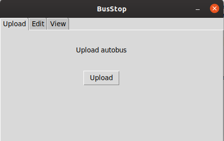
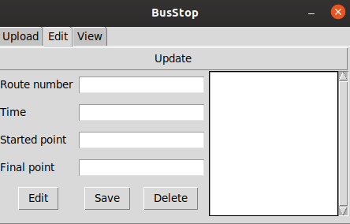
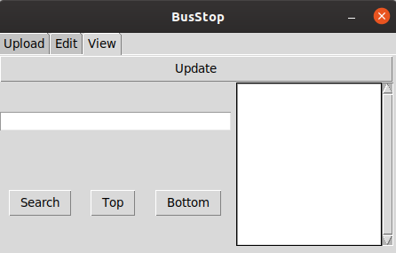

### BusStop

**Русский** | [English](../../README.md)

This project was developed by [Python 3.7](https://www.ics.uci.edu/~pattis/common/handouts/pythoneclipsejava/python.html).

**Содержание**

- [About app](#about-app)
- [Application launch](#application-launch)

#### About app
##### Dependencies
* [pip3](https://github.com/pypa/pip)
* [Python 3.7](https://www.ics.uci.edu/~pattis/common/handouts/pythoneclipsejava/python.html)

Since all packages are available in [Python 3.7](https://www.ics.uci.edu/~pattis/common/handouts/pythoneclipsejava/python.html)
then there is no need to install [Virtualenv](https://virtualenv.pypa.io/en/stable/installation/).
The application has three tabs:
- [Upload](#upload)
- [Edit](#edit)
- [View](#view)

Application saves data in format file **.tsv**.
 
All application results are written both to the console and to the file **api.log**.

The application allows you to both add data and edit it, sort and search by stop.
Also, when closing the application, the user will be given the opportunity to write file data.

##### Upload
On this tab, the user can download the file he needs. After downloading, the data ends up in the repository.

##### Edit
On this tab, the user can change, add and delete data (in order to get data from the repository it is necessary.
push button **update**)

##### View
On this tab, the user can search and sort data (in order to get data from the repository it is necessary.
push button **update**).

#### Application launch

To launch the application is quite simple, all you need to do is to execute two commands:

    cd src
    python app.py

These two simple steps will launch the application.