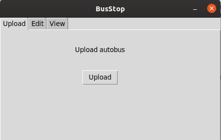
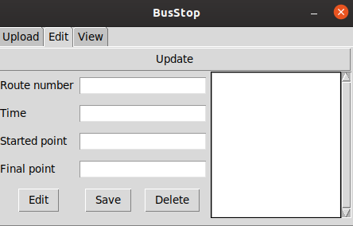

### Bus-time-table

**Русский** | [English](../../README.md)

Этот проект разработан на [Python 3.7](https://www.ics.uci.edu/~pattis/common/handouts/pythoneclipsejava/python.html).

**Содержание**

- [О приложение](#about-app)
- [Запуск приложения](#application-launch)

#### О приложение
##### Зависимости
* [pip3](https://github.com/pypa/pip)
* [Python 3.7](https://www.ics.uci.edu/~pattis/common/handouts/pythoneclipsejava/python.html)

Так как все пакеты имеются в [Python 3.7](https://www.ics.uci.edu/~pattis/common/handouts/pythoneclipsejava/python.html)
то нет необходимости устанавливать [Virtualenv](https://virtualenv.pypa.io/en/stable/installation/).
Приложение имеет три вкладки:
- [Upload](#upload)
- [Edit](#edit)
- [View](#view)

Приложение сохраняет данные в файл формата **.tsv**.
 
Все результаты приложения пишуться как в консоль так и в файл **api.log**.

Приложение позволяет как добавлять данные так и редоктировать их, сортеровать и искать по остановка.
Так же при закрытие приложения, пользователю будет предоставлена возможность записать данные файл.

#### Upload
На этой вкладке пользователь может загрузить необхомый ему файл. Данные после загрузки попадают в репозиторий.

#### Edit
На этой вкладке пользователь может изменять, добавлять и удалять данные (чтоб получить данные из репозитория необходимо.
нажать кнопку **update**)

#### View
На этой вкладке пользователь может искать и сортировать данные (чтоб получить данные из репозитория необходимо.
нажать кнопку **update**).

#### Запуск приложения

Для запуск приложения довольно просто, все что необходимо сделать это выполнить две команды:

    cd src
    python app.py

Два этих простых шага запустит приложение.